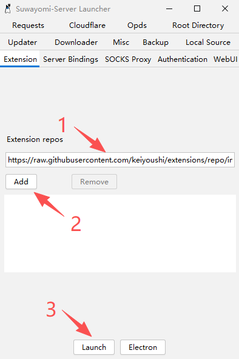

# SuwayomiGO🚀

SuwayomiGO 是一个轻量化的安卓漫画阅读器。它需要搭配漫画服务器 [Suwayomi-Server](https://github.com/Suwayomi/Suwayomi-Server)
使用（一个免费、开源、跨平台的漫画服务器，原名 Tachidesk）。
这个阅读器本质上是利用安卓设备上系统自带的WebView内核来访问 Suwayomi WebUI
的套壳客户端，在此基础上增强了一些功能和体验。

## ✨ 核心功能
- ⚡ **阅读助手**：加入日语查词与AI翻译功能，为你看生肉、学日语提供便利。
- 🔒 **自动登录**：支持保存WebUI的基础验证信息，自动完成服务器验证。
- 📖 **物理翻页**：支持使用音量键直接翻页，适配移动设备的物理按键。
- 🖼️ **图片保存**：支持直接将漫画页长按保存至本地相册，以漫画及章节命名。
- ✒ **适配墨水屏**：尽量减少界面动画，并支持按键翻页时全屏刷新以消除残影。
- 🔬 **更多功能酝酿中...**

## 🔍️ 简单演示

## 📘 快速开始
### Level1
0、准备工作：你需要一台能保持开机的电脑和一部不太旧的安卓设备。\
1、前往Suwayomi-Server的 [发布页](https://github.com/Suwayomi/Suwayomi-Server/releases)
下载适合你电脑系统的服务器安装包，新手建议选择Windows上手，家里有NAS的可自行docker部署。\
2、以Windows服务器为例，首先添加漫画源
https://raw.githubusercontent.com/keiyoushi/extensions/repo/index.min.json 点击启动。\
\
3、等待启动后，应该会跳出Suwayomi的WebUI界面，进入后可先设置语言，熟悉操作。\
4、漫画服务器准备就绪后，用安卓设备前往SuwayomiGO的 [发布页](https://github.com/lightningandme/SuwayomiGO/releases)
下载安装最新版，根据提示输入的服务器地址后进入页面。\
5、你需要在服务器电脑的网络属性里查询本机的局域网IP，例如192.168.xxx.xxx，Suwayomi-Server的默认端口为4567，
所以服务器地址填写192.168.xxx.xxx:4567，如果设置了基础验证，则还需填写用户名及密码。\
6、请确保安卓设备和服务器电脑处于同一个局域网中，如果前面的步骤没错，那么恭喜，你可以开始添加并阅读你喜欢的漫画了🎉

### Level2
如果你想激活阅读器的日语查词与AI翻译功能，你需要以下步骤：\
0、准备工作：你需要准备一个大模型的API，新手入门建议去 [deepseek开放平台](https://platform.deepseek.com/) 先充值10元后，创建API key使用。\
1、前往Manga-OCR-Server的发布页下载一键安装包，或自行使用python环境运行。\
2、OCR服务器准备就绪后，在SuwayomiGO客户端更多设置中填写OCR服务器地址和令牌，连接成功后点击保存。\
3、OCR模式打开方式为在漫画页面[大幅度下拉]或[长按音量+]。\
4、在OCR模式下，点按气泡、圈选文字均可查词，左右滑动可翻页，可参见简单演示中的动图。
